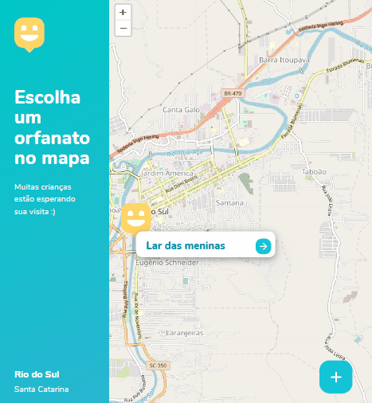

<h1 align="center">
    
</h1>

### Home
   
  
  ### Mapa dos Orfanatos
   
</h1>

## 💬 Sobre o projeto 
Esta aplicação feita especialmente para o dia das crianças, com o objetivo de conectar pessoas que querem visitar orfanatos e levar alegria para as crianças.

- Você pode criar e registrar orfanatos;
- Você pode marcar os dias para visitar orfanatos;
- Acessando horários e dias de funcionamento 📅;
- Agende visitas;
- Entre em contato pelo Whatsapp 📞;
- Veja as localizações através do Google Maps 🗺;
- Navegue por diferentes guias e páginas;

### 🛠 Tecnologias
As seguintes ferramentas foram usadas na construção do projeto:

- [HTML5](https://developer.mozilla.org/en-US/docs/Web/Guide/HTML/HTML5)
- [CSS3](https://developer.mozilla.org/pt-BR/docs/Learn/CSS/First_steps/O_que_e_CSS) 
- [JavaScript](https://exercism.io/my/tracks/javascript)
- [Node.js](https://nodejs.org/en/)
- [Express](https://expressjs.com/pt-br/)
- [SQLite](https://www.sqlite.org/index.html)
- [Handlebars](https://handlebarsjs.com/)


### 🎲 Pré-requisitos

Antes de começar, você vai precisar ter instalado em sua máquina as seguintes ferramentas:
[Git-Bash](https://git-scm.com), [Node.js](https://nodejs.org/en/).
Além disto é bom ter um editor para trabalhar com o código como [VSCode](https://code.visualstudio.com/download)

## 🔖 Layout
Você pode visualizar o layout do projeto através [desse link](https://www.figma.com/file/mDEbnoojksG4w8sOxmudh3/Happy-Web). <br> Lembrando que você precisa ter uma conta no [Figma](http://figma.com/) para acessá-lo.


<h2 align="center">Notion Files 📋</h2>

- [NLW3 #03](https://www.notion.so/NLW-Discovery-03-628a2c1b9ac744e28fad80046b699aab) 🚀
- [Front-end](https://www.notion.so/Front-end-010548f316d04d65a0d8b72865874ed1) ☕
- [Back-end](https://www.notion.so/Back-end-ff655163e56b4927ae7a7a4e08049e64) 👨‍🍳
- [Database](https://www.notion.so/Banco-de-Dados-ba70111f89924bda94bb1016f12df8c8) 📦

### 🚀 Rodando a aplicação web

```bash
# Clone este repositório
$ git clone https://github.com/jucelania/happy-nlw3
# Faça um Fork do projeto 

# Instale as dependências
$ npm install

# Enter in directory:
$ cd Happy

# Vá para a pasta da aplicação Front End
$ npm start

# A aplicação será aberta em acesse http://localhost:5500
```

## 💪 Como contribuir 

```bash
- Fork the project 

- Create a new branch with your changes:
$ git checkout -b my-feature

- Save your changes and create a commit message telling you what you did:
$ git commit -m "feature: My new feature"

- Submit your changes:
$ git push origin my-feature

````

## 📝 Licenças

Esse projeto está sob a licença MIT. Veja o arquivo [LICENSE](LICENSE.md) para mais detalhes.


## 🙌 Agradecimentos

- [Time da RocketSeat](https://rocketseat.com.br/)
- [Mayk Brito, instrutor da Rocketseat](https://github.com/maykbrito)
- [Diego Fernandes, CTO e Instrutor da Rocketseat](https://github.com/diego3g)


<h1 align="center">

[](https://www.linkedin.com/in/jucel%C3%A2nia-silva-56a375197/) [](https://www.instagram.com/jullydeveloper/) 
</h1>


